# rusty-sunspec-collector

High-concurrency, memory-safe edge service that polls Modbus TCP inverters, parses SunSpec models, and publishes serialized data to Kafka. Built as a Cargo workspace with clear domain boundaries to keep build times and dependencies under control.

## Features

- Async Modbus TCP client with timeouts, retries, and device-quirk controls (`max_batch_size`, optional inter-read delay).
- SunSpec model parser (JSON/XML) with scale-factor handling and “Not Implemented” sentinel detection.
- SunSpec register-map discovery helper (SunS sentinel + model list parsing).
- Per-device poller actors using Tokio, supervised via `JoinSet` to auto-respawn failures.
- Collector orchestrator with bounded telemetry channel and graceful shutdown handling.
- SQLite buffer for store-and-forward durability on intermittent links.
- Avro/Kafka publisher with schema serialization and Kafka producer integration.
- Discovery service with subnet scan and static-config mode for sensitive networks.
- systemd READY/WATCHDOG notifications on Linux for service supervision.
- TOML/JSON config loader with env overrides, validation, and `--config` CLI support.

## Workspace layout

- `crates/collector-app` — binary orchestrator.
- `crates/modbus-client` — Tokio Modbus wrapper and quirks config.
- `crates/sunspec-parser` — model registry, scaling, sentinel handling.
- `crates/poller-actor` — per-inverter polling loop and supervision hooks.
- `crates/avro-kafka` — Avro schemas and Kafka producer wrapper.
- `crates/buffer` — SQLite-backed store-and-forward buffer.
- `crates/discovery` — subnet scanning and static device list support.
- `crates/types` — shared DTOs/traits (kept lightweight).
- `docs/` — design notes and backlog (`docs/plan.md`).

## Roadmap (high level)

- Foundation: cross-compile setup, Modbus client and discovery plumbing.
- Core logic: SunSpec discovery, scale-factor normalization, poller actors.
- Persistence + uplink: SQLite buffer, Avro serialization, Kafka publishing.
- Hardening: watchdog, ops docs, and deployment artifacts.

See `docs/plan.md` for the current execution tracker.

## Getting started

1. Install Rust (latest stable recommended).
2. Clone the repo and build: `cargo build --workspace`.
3. Run lint/tests: `cargo fmt && cargo clippy && cargo test --workspace`.
4. For Modbus simulation during development, use a local simulator such as `diagslave` and point the client to it.
5. Optional Modbus integration test (requires a running simulator): `MODBUS_TEST_HOST=127.0.0.1 MODBUS_TEST_PORT=1502 cargo test -p modbus-client --test diagslave_tests`.
6. Optional synthetic end-to-end harness (no simulator required): `cargo test -p collector-app --test e2e_harness_tests`.
7. Optional Kafka integration test (requires a running broker): `SUNSPEC_KAFKA_BROKERS=localhost:9092 cargo test -p avro-kafka --test kafka_integration_tests`.
8. Run with a config file (optional): `cargo run -p collector-app -- --config docs/config.example.toml`.

## Configuration (env)

To avoid long env lists, you can point to a TOML or JSON file with `SUNSPEC_CONFIG=/path/to/config.toml` or pass `--config /path/to/config.toml` to the binary. Env vars override file values when set. See `docs/config.example.toml` for a starter config. Validation enforces IPv4 CIDR for discovery subnets and Kafka topic format rules.

### Discovery

- `SUNSPEC_SUBNET`: CIDR subnet for discovery (default `192.168.1.0/24`).
- `SUNSPEC_PORT`: Modbus TCP port (default `502`).
- `SUNSPEC_STATIC_DEVICES`: comma-separated `ip[:unit_id]` list to bypass subnet scans (example: `192.168.1.20:1,192.168.1.21`).

### Polling

- `SUNSPEC_POLL_INTERVAL_MS`: poll interval in milliseconds (default `1000`).
- `SUNSPEC_REQUEST_TIMEOUT_MS`: per-request timeout in milliseconds (default `1000`).
- `SUNSPEC_JITTER_MS`: jitter added to poll interval (default `0`).

### Modbus client

- `SUNSPEC_MAX_BATCH_SIZE`: max registers per read batch.
- `SUNSPEC_MODBUS_TIMEOUT_MS`: Modbus request timeout override.

### SunSpec discovery

- `SUNSPEC_BASE_ADDRESS`: base address for the SunSpec sentinel (default `40000`).
- `SUNSPEC_DISCOVERY_REG_COUNT`: number of registers to read for model discovery (default `200`).

### Buffer + uplink

- `SUNSPEC_BUFFER_PATH`: SQLite path for buffered payloads (default `sunspec-buffer.sqlite`).
- `SUNSPEC_BUFFER_BATCH_SIZE`: number of buffered messages to drain per cycle (default `100`).
- `SUNSPEC_BUFFER_DRAIN_MS`: drain interval in milliseconds (default `500`).

### Kafka

- `SUNSPEC_KAFKA_BROKERS`: Kafka bootstrap servers (example: `localhost:9092`).
- `SUNSPEC_KAFKA_TOPIC`: topic name for telemetry (default `sunspec.telemetry`).
- `SUNSPEC_KAFKA_CLIENT_ID`: Kafka client id (default `sunspec-collector`).
- `SUNSPEC_KAFKA_ACKS`: producer acks (default `all`).
- `SUNSPEC_KAFKA_COMPRESSION`: compression type (default `zstd`).
- `SUNSPEC_KAFKA_TIMEOUT_MS`: producer message timeout in ms (default `5000`).
- `SUNSPEC_KAFKA_IDEMPOTENCE`: `true`/`false` toggle for idempotent producer.

## Deployment

- systemd unit template: `docs/sunspec-collector.service`
- Example environment file: `docs/sunspec-collector.env`
- Build/test/run workflows: `docs/build.md`
- Runtime operations: `docs/ops.md`
- Buffer maintenance: `docs/buffer_maintenance.md`

## Cross-compilation (ARM64)

1. Build the custom cross image: `docker build -t sunspec-cross-arm64 -f docker/Dockerfile.arm64 .`
2. Build with cross: `cross build --release --target aarch64-unknown-linux-gnu`
3. Binary output: `target/aarch64-unknown-linux-gnu/release/collector-app`

## Contributing

Issues and PRs are welcome. Please keep the `types` crate slim and avoid adding heavy deps to shared crates. See `docs/plan.md` for current priorities.

## License

Dual-licensed under MIT or Apache-2.0 (see workspace `Cargo.toml`).
