# Rusty SunSpec Collector

High-concurrency, memory-safe edge service that polls Modbus TCP inverters, parses SunSpec models, and publishes serialized telemetry to Apache Kafka.

Built as a Cargo workspace with 8 crates and clear domain boundaries to keep build times and dependencies under control.



---

## Features

- **Reliable Polling** — Per-device actor supervision with automatic respawn and exponential backoff.
- **Efficient Uplink** — Avro OCF batching with Deflate compression reduces Kafka message overhead by ~90%.
- **Flexible Discovery** — CIDR subnet scanning and static device lists with multi-Unit ID gateway support.
- **Durable Buffering** — SQLite WAL-mode queue ensures zero data loss during network outages.
- **Observability** — Prometheus metrics endpoint for monitoring throughput, latency, queue depth, and errors.
- **Production Ready** — Docker container (non-root, healthcheck), systemd integration, CI/CD pipeline.

---

## Quick Start

### Docker (recommended)

```sh
docker build -t sunspec-collector .
docker run -p 9090:9090 --env-file .env -v sunspec-data:/app/data sunspec-collector
```

### Local development

```sh
# Prerequisites: Rust 1.80+, cmake, libssl-dev, pkg-config
cargo build --workspace
cargo test --workspace
cargo run -p collector-app -- --config docs/config.example.toml
```

See the [Developer Guide](DEVELOPER_GUIDE.md) for full setup instructions.

---

## Documentation Map

| Guide | Audience | Contents |
|-------|----------|----------|
| [Getting Started](DEVELOPER_GUIDE.md) | Developers | Prerequisites, build, test, run, CI/CD |
| [Configuration](configuration.md) | All users | Config file reference, environment variables, validation |
| [Architecture](ARCHITECTURE.md) | Developers | System design, data flow, design decisions |
| [Operations](ops.md) | Operators | Deployment, monitoring, maintenance, troubleshooting |

### Reference

| Document | Purpose |
|----------|---------|
| [Design Plan](plan.md) | Original design document and roadmap |
| [Code Review](CODE_REVIEW.md) | Audit findings and resolutions |

---

## Workspace Layout

```
crates/
  types/            Shared data types (PointValue, DeviceIdentity)
  discovery/        Network scanning and device enumeration
  modbus-client/    Modbus TCP client with retry and backoff
  sunspec-parser/   SunSpec model parsing (JSON, XML, registers)
  poller-actor/     Per-device async polling loop
  buffer/           SQLite-backed durable message queue
  avro-kafka/       Avro serialization and Kafka producer
  collector-app/    Main binary — orchestrates everything
```

---

## License

Dual-licensed under MIT or Apache-2.0.
